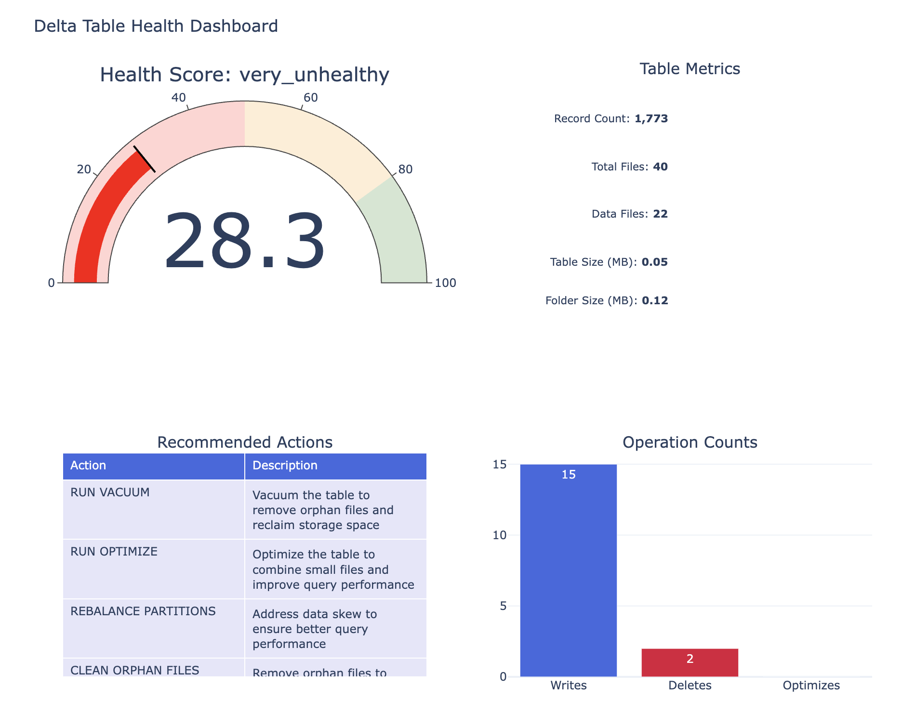
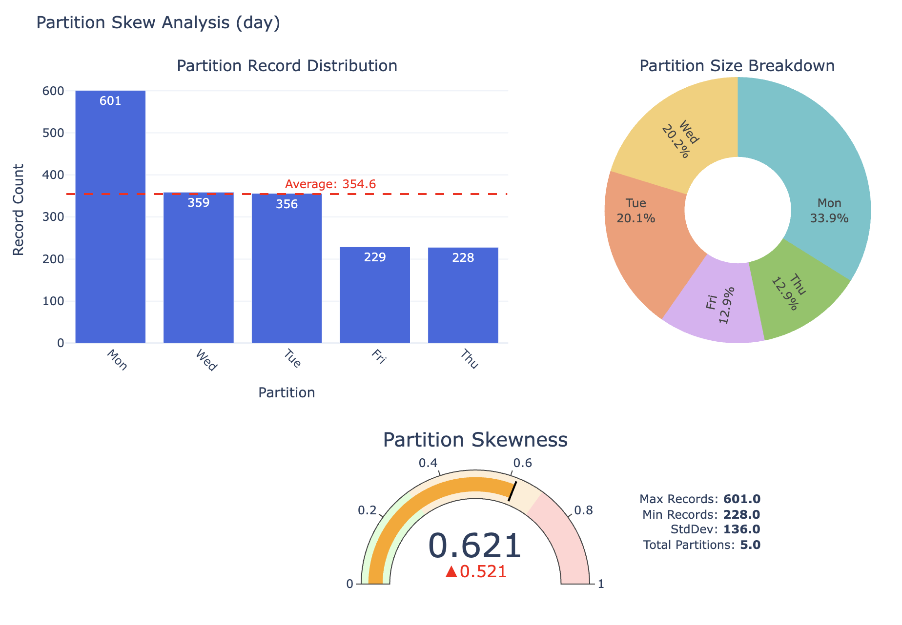
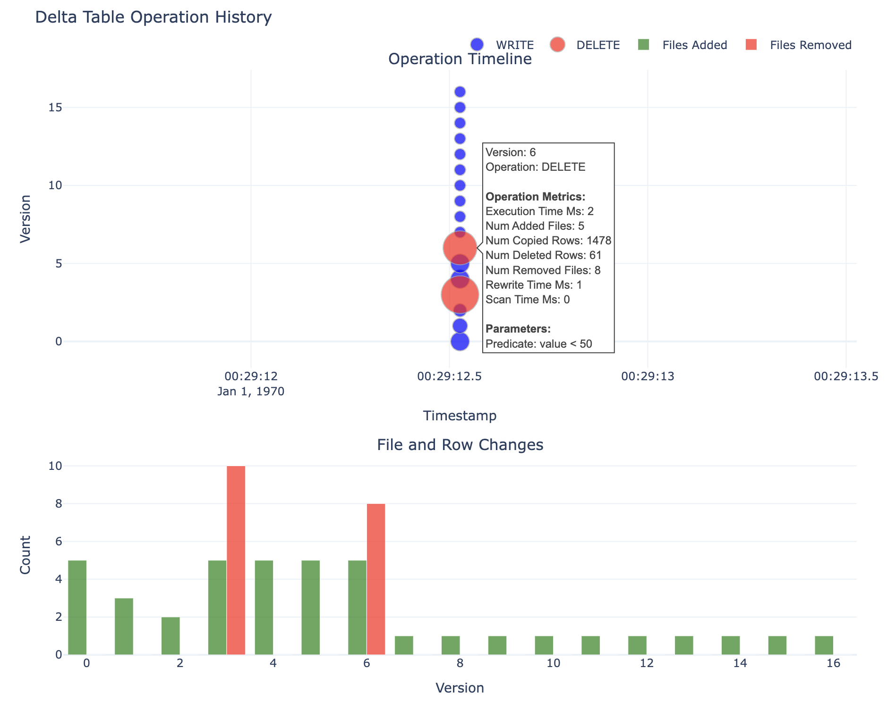

# Delta Lake Health

Delta Lake Health is a Python toolkit for analyzing, testing, and maintaining the health of Delta Lake tables using the open-source [deltalake](https://github.com/delta-io/delta-rs) library and [Polars](https://www.pola.rs/). It provides metrics, skewness analysis, orphan file detection, and utilities for robust data engineering workflows—without requiring Spark or Databricks.

## Features
- **Delta Table Health Analysis**: Extracts metrics such as version count, write/delete/optimize operations, table size, and partition skewness.
- **Orphan File Detection**: Identifies files in the table folder that are not referenced by the Delta log.
- **Skewness Analysis**: Uses Polars to detect partition imbalance and recommend optimizations.
- **Table Size Metrics**: Reports both total folder size and actual Delta data size.
- **Vacuum & Optimize Recommendations**: Flags tables needing cleanup or compaction.
- **Sample Data Population & Cleanup**: Includes demo scripts for generating and cleaning sample Delta tables.
- **Pytest-Based Testing**: Comprehensive tests for all core metrics and health checks.

## Quickstart

### 1. Install dependencies
```bash
pip install -r requirements.txt
```

### 2. Populate a sample Delta table
```bash
python src/delta_lake_health/demos/populate_sample_delta.py
```

### 3. Run health analysis
```python
from src.delta_lake_health.health_analyzers.delta_analyzer import DeltaAnalyzer
analyzer = DeltaAnalyzer(environment="python")
result = analyzer.analyze(table_path="./data/tables/tips")
print(result)
```

### 4. Clean up sample data
```bash
python src/delta_lake_health/demos/clean_delta_data.py
```

## Testing
Run all tests with:
```bash
python -m pytest test --maxfail=3 --disable-warnings -v
```

## Project Structure
```
src/delta_lake_health/
    health_analyzers/
        delta_analyzer.py      # Main health analysis logic
        base_analyzer.py       # Metrics models and base classes
    demos/
        populate_sample_delta.py  # Demo: populate table with random data
        clean_delta_data.py       # Demo: clean up sample data
    __init__.py
notebooks/
    example.ipynb
```

## Example Metrics
- `number_of_writes`, `number_of_deletes`, `number_of_optimizes`
- `skewness_max`, `skewness_average`, `is_skewed`
- `table_size_bytes`, `folder_size_bytes`
- `has_orphan_files`, `needs_vacuum`, `needs_optimize`, `small_files_count`, `avg_file_size_bytes`

## Example Visualizations

Delta Lake Health provides interactive Plotly dashboards for table analysis:

- **Health Dashboard**: Overall health score, table metrics, recommended actions, and operation counts.
- **Partition Skew Analysis**: Visualizes partition record distribution, skewness gauge, and metrics.
- **Delta Operations Timeline**: Shows operation history, file/row changes, and operation types.





## License
MIT
